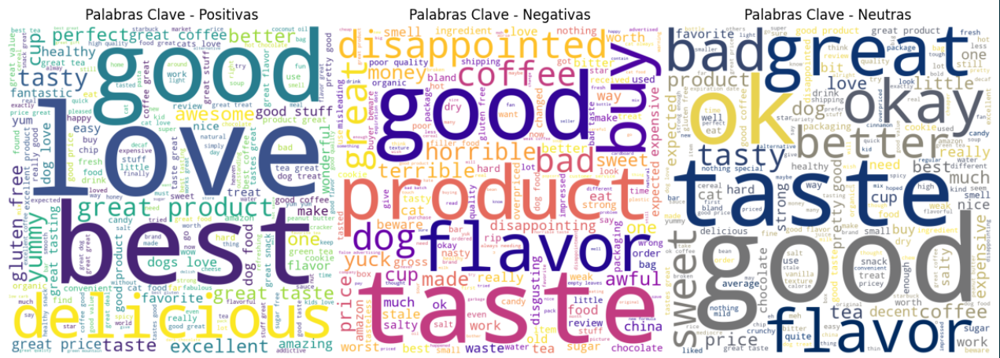

# Sentiment Analysis with NLP, Machine Learning and Deep Learning

This project focuses on **Sentiment Analysis** using Natural Language Processing techniques.  
Different approaches were implemented and compared to classify text reviews as **Positive**, **Neutral**, or **Negative**.

The project covers the **full NLP pipeline**, from data cleaning and preprocessing to model training, evaluation, and comparison of multiple sentiment analysis techniques.

---

## Project Overview

The objective of this project is to analyze textual opinions and determine their sentiment polarity using three main approaches:

- Lexicon-based methods (Dictionary approach)
- Machine Learning models
- Deep Learning neural networks

The dataset used contains **Amazon Fine Food Reviews**, and the workflow includes exploratory data analysis, text preprocessing, feature engineering, model training, and evaluation.

---

## Architecture / Workflow

### System Pipeline

> You can place your workflow or architecture diagram inside a folder like `/docs` and update the image path below.

### General Workflow
Raw Text Reviews
↓
Exploratory Data Analysis (EDA)
↓
Text Cleaning & Preprocessing
↓
Text Normalization (lowercase, stopwords, stemming, lemmatization)
↓
Feature Extraction (TF-IDF / Embeddings)
↓
Model Training
├── Lexicon-Based
├── Machine Learning
└── Deep Learning
↓
Model Evaluation & Comparison

---

## Dataset

**Source:** Amazon Fine Food Reviews (Kaggle)

The dataset includes product reviews with scores that were transformed into sentiment labels:

- Positive  
- Neutral  
- Negative  

Main columns used:
- `Score` → Used to derive sentiment labels  
- `Text` → Review text analyzed  

---

## Data Preprocessing

The following preprocessing steps were applied:

- Removal of HTML tags, links, emails, and special characters  
- Lowercasing all text  
- Stopword removal  
- Stemming and Lemmatization  
- Tokenization  
- Handling class imbalance through dataset balancing  

These steps helped reduce noise and improve model performance.

---

## Approaches Implemented

### 1. Lexicon-Based Sentiment Analysis

Sentiment dictionaries were used to assign polarity scores to words:

- Harvard IV-4 Dictionary  
- Opinion Lexicon  

**Pros**
- Simple and fast  
- No training required  

**Cons**
- Limited vocabulary  
- Poor handling of sarcasm and context  

---

### 2. Machine Learning Models

Traditional ML classifiers were trained using **TF-IDF** features.

Models implemented:

- Logistic Regression  
- Decision Tree  
- Support Vector Machine (SVM)  

These models showed **stable and competitive performance** compared to other approaches.

---

### 3. Deep Learning Models

Neural networks were built using word embeddings and dense layers.

Two embedding strategies were tested:

- Pretrained embeddings  
- Embeddings learned from the dataset  

Although deep learning models are powerful, performance was affected by computational limitations during training.

---

## Results Summary

| Approach              | Performance Overview |
|-----------------------|----------------------|
| Lexicon-Based         | Fast but biased toward positive sentiment |
| Machine Learning      | Most balanced and stable results |
| Deep Learning         | Promising but limited by training resources |

Machine learning models provided the most consistent predictions across sentiment classes.

---

## Technologies Used

### Programming Language
- Python

### NLP & Data Processing
- NLTK  
- Scikit-learn  
- Pandas  
- NumPy  
- Regex  

### Machine Learning
- Scikit-learn (LR, DT, SVM)

### Deep Learning
- TensorFlow  
- Keras  

### Visualization
- Matplotlib  
- WordCloud  

---

